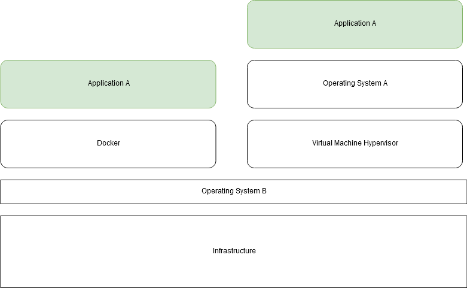
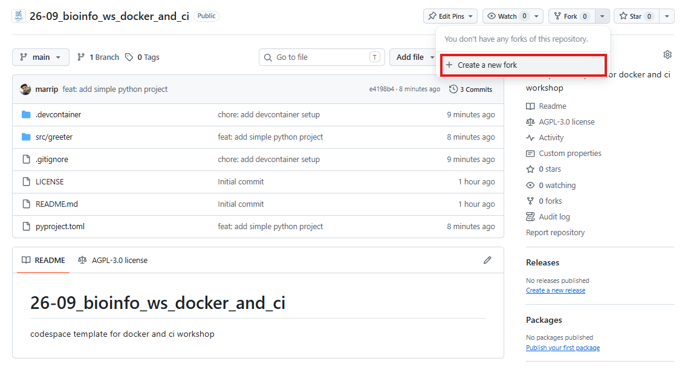
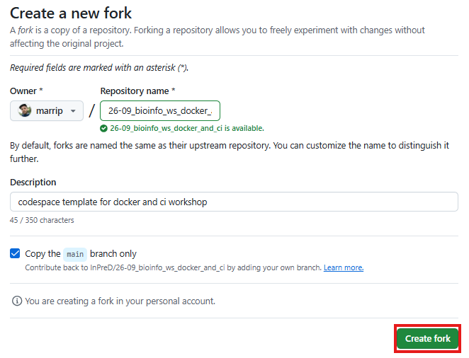
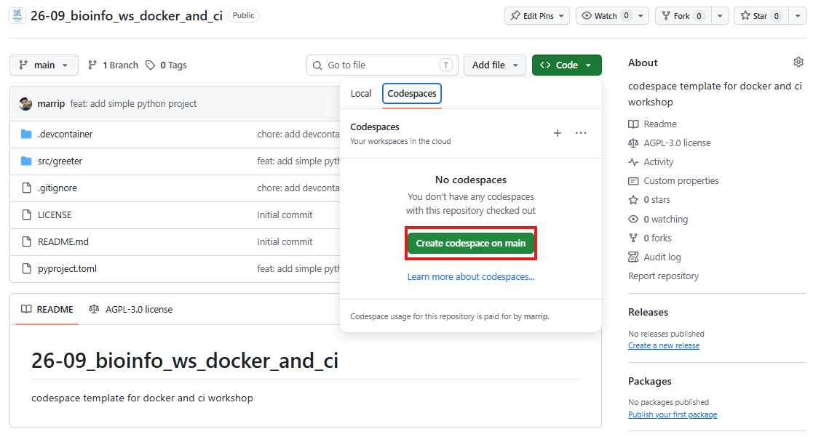

# Bioinformatics session

4th annual workshop on bioinformatics and variant interpretation in InPreD

<https://inpred.github.io/26-09_bioinfo_ws/>


---

## 2. Containerization


    
---

### A brief history 📓

&nbsp; | &nbsp;
---|---
**1979** | `chroot` system call (changing the root directory of a process and its children to a new location in the filesystem) in Uni V7 considered as beginning of process isolation
**2000** | FreeBSD Jails allows administrators to partition FreeBSD computer system into several independent, smaller systems (*jails*) – with the ability to assign IP address for each system and configuration
**2001** | Linux VServer is jail mechanism that can partition resources, similar to FreeBSD Jails
    
---

&nbsp; | &nbsp;
---|---
**2004** | First public beta of Solaris Containers released - combines system resource controls and boundary separation provided by zones
**2005** | Open Virtuzzo is operating system-level virtualization technology for Linux which uses patched Linux kernel for virtualization, isolation, resource management and checkpointing
**2006** | Process Containers, launched by Google, was designed for limiting, accounting and isolating resource usage of collection of processes - renamed to *Control Groups (cgroups)* and merged into Linux kernel
**2008** | LinuX Containers (LXC) was first, most complete implementation of Linux container manager - implemented using cgroups and Linux namespaces

---

&nbsp; | &nbsp;
---|---
**2011** | CloudFoundry started Warden can isolate environments on any operating system running as daemon and providing API for container management
**2013** | Let Me Contain That For You (LMCTFY) kicked off as open-source version of Google’s container stack - providing Linux application containers
**2013** | Docker emerged
**2016** | Singularity (later Apptainer) was released

---

### Docker

#### What is it? 🔎

- containerization technology to package application and dependencies into a container
- the container image can be shipped and run consistently across different computing environments

---

#### Which benefits does it provide? 🎁

1. Consistency
1. Isolated environments
1. Portability
1. Efficiency


---

#### How is it different from virtual machines? 💻

- containers use and share host OS's kernel making them more lightweight and efficient
- virtual machines emulate entire physical machine, including OS making it possible to run multiple OS instances on single physical machine

---



---

#### Key Concepts 🔑

1. **Image:** standardized package that includes all files, binaries, libraries, and configurations to run container
1. **Container:** running instance of image providing isolated runtime environment
1. **Dockerfile:** instructions on how to build image
1. **Docker Hub:** public registry where developers can share and access pre-built images

---

#### Key Components 🔑

1. **Docker Engine:** core, open-source technology that builds and runs containers
1. **Docker Client:** command-line tool that sends instructions to the Docker Daemon using REST APIs
1. **Docker Daemon (`dockerd`):** receives and processes API requests and calls container runtime
1. **Container Runtime (`containerd`):** turns static container image into running, isolated application on host OS; industry standard

---

#### Let's explore! 🗺️

Start by going to https://github.com/InPreD/26-09_bioinfo_ws_docker_and_ci and create a fork.



---

Create your own fork by clicking on `Create fork`.



---

In the forked repository, navigate to `Code`>`Codespaces`>`Create codespace on main`.



---

Inside the terminal, run the following commands:

```bash
# check for running docker containers
$ docker ps
# check for existing images
$ docker images
# pull image
$ docker pull ubuntu:26.04
# run image
$ docker run ubuntu:26.04
```

---

Run an interactive container:

```bash
# start interactive container
$ docker run -it ubuntu:26.04
# print container os version
@ cat /etc/lsb-release
# exit container
@ exit
# print os version
$ lsb_release -a
```

---

Instruct docker to remove containers after use:

```bash
# check for any docker container
$ docker ps -a
# remove stopped container
$ docker rm <container hash>
# run docker with --rm flag
$ docker run -it --rm ubuntu:26.04
# exit container
@ exit
# check for all docker containers
$ docker ps -a
```

---

Remove the docker image:

```bash
# remove docker image
$ docker rmi ubuntu:26.04
# alternatively
$ docker rmi <container image hash>
```

---

#### Building an image 🔧

We start off by creating a `Dockerfile` in the root directory of our repository. We add the following to our file:

```bash
FROM python:3.14-slim-trixie
RUN echo "Hello world!" > greetings.txt
```

And then we build and run our docker image:

```bash
# build tagged docker image
$ docker build . -t greeter:test
# run tagged docker image
$ docker run --rm greeter:test cat greetings.txt
```

---

Let us add a label to our `Dockerfile` to indicate who the author and maintainer is:

```bash
FROM python:3.14-slim-trixie
LABEL org.opencontainers.image.authors="martin.rippin@helse-bergen.no"
RUN echo "Hello world!" > greetings.txt
```

And then we build and inspect our docker image:

```bash
# build tagged docker image
$ docker build . -t greeter:test
# run tagged docker image
$ docker inspect greeter:test
```

---

Next, we are setting `cat greetings.txt` as a default command that is run whenever the container is started:

```bash
FROM python:3.14-slim-trixie
LABEL org.opencontainers.image.authors="martin.rippin@helse-bergen.no"
RUN echo "Hello world!" > greetings.txt
CMD ["cat","greetings.txt"]
```

And then we build and run our docker image:

```bash
# build tagged docker image
$ docker build . -t greeter:test
# run tagged docker image
$ docker run --rm greeter:test
```

---

There is a small python application in this repository that we would like to include in our docker image:

```bash
FROM python:3.14-slim-trixie
LABEL org.opencontainers.image.authors="martin.rippin@helse-bergen.no"
WORKDIR /usr/src/greeter
COPY pyproject.toml ./
COPY src/ ./src/
RUN pip install .
CMD ["greeter"]
```

And then we build and run our docker image:

```bash
# build tagged docker image
$ docker build . -t greeter:test
# run tagged docker image
$ docker run --rm greeter:test
```


---

A full list of `Dockerfile` instructions can be found here:

https://docs.docker.com/reference/dockerfile#overview

---

### Apptainer

#### What is it? 🔎

- container platform designed for ease-of-use on shared systems and in high performance computing (HPC) environments

---

#### How is it different from Docker? 🅰️🆚🐋

Apptainer | Docker
---|---
without root-privileges by default | requires root privileges for most operations
SIF (Singularity Image Format) – immutable, portable, cryptographically signed | Docker/OCI images – layered file systems, mutable by default
can run Docker/OCI images | cannot run SIF images

---

#### Let's explore! 🗺️

Similar to Docker, Apptainer provides a cli:

```bash
# check for any apptainer container
$ apptainer instance list -a
# pull image
$ apptainer pull docker://ubuntu:26.04
# check identity
$ whoami
# check identity in container
$ apptainer exec docker://ubuntu:26.04 whoami
```

The container image is saved as a `.sif`-file to the working directory.

---

#### Building an image 🔧

We are creating a file called `greeter.def` in the root of our repository and add the following lines:

```bash
Bootstrap: docker
From: python:3.14-slim-trixie

%post
    echo "Hello world!" > /usr/src/greetings.txt
```

And then we build and run our apptainer image:

```bash
# build apptainer image
$ apptainer build greeter.sif greeter.def
# execute apptainer image
$ apptainer exec greeter.sif cat /usr/src/greetings.txt
```

---

A full list of apptainer definition file sections can be found here:

https://apptainer.org/docs/user/main/definition_files.html#sections

---

## 3. Continuous Integration (CI)


    
---