# Bioinformatics session

4th annual workshop on bioinformatics and variant interpretation in InPreD

<https://inpred.github.io/26-09_bioinfo_ws/>


---

## 2. Containerization


    
---

### A brief history 📓

&nbsp; | &nbsp;
---|---
**1979** | `chroot` system call (changing the root directory of a process and its children to a new location in the filesystem) in Uni V7 considered as beginning of process isolation
**2000** | FreeBSD Jails allows administrators to partition FreeBSD computer system into several independent, smaller systems (*jails*) – with the ability to assign IP address for each system and configuration
**2001** | Linux VServer is jail mechanism that can partition resources, similar to FreeBSD Jails
    
---

&nbsp; | &nbsp;
---|---
**2004** | First public beta of Solaris Containers released - combines system resource controls and boundary separation provided by zones
**2005** | Open Virtuzzo is operating system-level virtualization technology for Linux which uses patched Linux kernel for virtualization, isolation, resource management and checkpointing
**2006** | Process Containers, launched by Google, was designed for limiting, accounting and isolating resource usage of collection of processes - renamed to *Control Groups (cgroups)* and merged into Linux kernel
**2008** | LinuX Containers (LXC) was the first, most complete implementation of a Linux container manager - implemented using cgroups and Linux namespaces

---

&nbsp; | &nbsp;
---|---
**2011** | Warden from Cloud Foundry can isolate environments on any operating system, runs as a daemon and provides API for container management
**2013** | Let Me Contain That For You (LMCTFY) kicked off as open-source version of Google’s container stack - providing Linux application containers
**2013** | Docker emerged
**2016** | Singularity (later Apptainer) was released

---

### Docker

#### What is it? 🔎

- a technology for packaging an application with all of its dependencies into an independent executable unit (a container)
- the container image can be shipped and run consistently across different computing environments

---

#### Which benefits does it provide? 🎁

1. Consistency
1. Isolated environments
1. Portability
1. Efficiency


*https://scalablehuman.com/2023/10/24/the-fallacy-of-it-works-on-my-machine*

---

#### How is it different from virtual machines? 💻

- containers use and share host OS's kernel, which makes them more lightweight and efficient
- virtual machines emulate entire physical machines, including the complete OS, making it possible to run multiple OS instances on a single physical machine

---


*https://dev.to/swikritit/docker-for-dummies-introduction-to-docker-5h67*

---

#### Key Concepts 🔑

1. **Image:** a standardized package that includes all files, binaries, libraries, and configurations necessary to run a given container
1. **Container:** a running instance of an image, operating in an isolated runtime environment
1. **Dockerfile:** instructions on how to build an image
1. **Docker Hub:** a public registry where developers can share their pre-built images

---

#### Key Components 🔑

1. **Docker Engine:** core, open-source technology that builds and runs containers
1. **Docker Client:** command-line tool that sends instructions to the Docker Daemon using REST APIs
1. **Docker Daemon (`dockerd`):** receives and processes API requests and calls container runtime
1. **Container Runtime (`containerd`):** turns static container image into running, isolated application on host OS; industry standard

---

#### Let's explore! 🗺️

Start by going to https://github.com/InPreD/26-09_bioinfo_ws_docker_and_ci and create a fork.


---

Create your own fork by clicking on `Create fork`.


---

In the forked repository, navigate to `Code`>`Codespaces`>`Create codespace on main`.


---

Inside the terminal, run the following commands:

```bash
# check for running docker containers
$ docker ps
# check for existing images
$ docker images
# pull image
$ docker pull ubuntu:26.04
# run image
$ docker run ubuntu:26.04
```

---

Run an interactive container:

```bash
# start interactive container
$ docker run -it ubuntu:26.04
# print container os version
@ cat /etc/lsb-release
# exit container
@ exit
# print os version
$ lsb_release -a
```

---

Instruct docker to remove containers after use:

```bash
# check for any docker containers
$ docker ps -a
# remove all stopped containers
$ docker rm <CONTAINER ID>
# run docker with --rm flag
$ docker run -it --rm ubuntu:26.04
# exit container
@ exit
# check for all docker containers
$ docker ps -a
```

---

Remove the docker image:

```bash
# remove docker image
$ docker rmi ubuntu:26.04
# alternatively check for container image id
$ docker images
# and remove the image by using the id
$ docker rmi <ID>
```

---

#### Building an image 🔧

We start off by creating a `Dockerfile` in the root directory of our repository (`/workspaces/26-09_bioinfo_ws_docker_and_ci`). We add the following to our file:

```bash
FROM python:3.14-slim-trixie
RUN echo "Hello world!" > greetings.txt
```

And then we build and run our docker image:

```bash
# build tagged docker image
$ docker build . -t greeter:test
# run tagged docker image
$ docker run --rm greeter:test cat greetings.txt
```

---

Let us add a label to our `Dockerfile` to indicate who the author and maintainer is:

```bash
FROM python:3.14-slim-trixie
LABEL org.opencontainers.image.authors="martin.rippin@helse-bergen.no"
RUN echo "Hello world!" > greetings.txt
```

And then we build and inspect our docker image:

```bash
# build tagged docker image
$ docker build . -t greeter:test
# run tagged docker image
$ docker inspect greeter:test
```

---

Next, we are setting `cat greetings.txt` as a default command that is run whenever the container is started:

```bash
FROM python:3.14-slim-trixie
LABEL org.opencontainers.image.authors="martin.rippin@helse-bergen.no"
RUN echo "Hello world!" > greetings.txt
CMD ["cat","greetings.txt"]
```

And then we build and run our docker image:

```bash
# build tagged docker image
$ docker build . -t greeter:test
# run tagged docker image
$ docker run --rm greeter:test
```

---

There is a small python application in this repository that we would like to include in our docker image:

```bash
FROM python:3.14-slim-trixie
LABEL org.opencontainers.image.authors="martin.rippin@helse-bergen.no"
WORKDIR /usr/src/greeter
COPY pyproject.toml ./
COPY src/ ./src/
RUN pip install --no-cache-dir .
CMD ["greeter"]
```

And then we build and run our docker image:

```bash
# build tagged docker image
$ docker build . -t greeter:test
# run tagged docker image
$ docker run --rm greeter:test
```


---

A full list of `Dockerfile` instructions can be found here:

https://docs.docker.com/reference/dockerfile#overview

---

### Apptainer

#### What is it? 🔎

- container platform designed for ease-of-use on shared systems and in high performance computing (HPC) environments

---

#### How is it different from Docker? 🅰️🆚🐋

Apptainer | Docker
---|---
without root-privileges by default | requires root privileges for most operations
SIF (Singularity Image Format) – immutable, portable, cryptographically signed | Docker/OCI images – layered file systems, mutable by default
can run Docker/OCI images | cannot run SIF images

---

#### Let's explore! 🗺️

Similar to Docker, Apptainer provides a cli:

```bash
# check for any apptainer container
$ apptainer instance list -a
# pull image
$ apptainer pull docker://ubuntu:26.04
# check identity
$ whoami
# check identity in container
$ apptainer exec docker://ubuntu:26.04 whoami
```

The container image is saved as a `.sif`-file to the working directory.

---

#### Building an image 🔧

We are creating a file called `greeter.def` in the root of our repository and add the following lines:

```bash
Bootstrap: docker
From: python:3.14-slim-trixie

%post
    echo "Hello world!" > /usr/src/greetings.txt
```

And then we build and run our apptainer image:

```bash
# build apptainer image
$ apptainer build greeter.sif greeter.def
# execute apptainer image
$ apptainer exec greeter.sif cat /usr/src/greetings.txt
```

---

A full list of apptainer definition file sections can be found here:

https://apptainer.org/docs/user/main/definition_files.html#sections

---

## 3. Continuous Integration (CI)


    
---

### What is it?

- automating integration of code changes from multiple contributors into single software project
- developers frequently merge code changes into central repository where automated tools are used to assert new code’s correctness before integration (test, lint, build)

---

### Which benefits does it provide?

- scale up delivery output
- enables parallel work on features

---

### GitHub actions

#### What is it? 🔎

- GitHub's continuous integration automation platform
- repetitive tasks are triggered based on code pushes, pull requests, or custom schedules

---

#### How does it work? 🤔


*https://www.geeksforgeeks.org/git/introduction-to-github-actions*

---

##### Workflow:

- [`.yaml`-file](https://docs.github.com/en/actions/reference/workflows-and-actions/workflow-syntax) located at `.github/workflows/` containing CI instructions

##### Event

- defined in workflow file
- trigger to start workflow, e.g. push, pull_request, schedule, [etc.](https://docs.github.com/en/actions/reference/workflows-and-actions/events-that-trigger-workflows)

##### Jobs

- defined in workflow file
- contains several tasks/*steps* and is running on a specific runner (server executing the code of the workflow)
- jobs run in parallel or can depend on each other, e.g. testing before building a container image

---

##### Step

- single task inside a job, e.g. installing python

##### GitHub Action

- reusable steps written by other developers that are freely available
- shorter workflows and avoiding unnecessary repetition

---

#### Example ⚙️

```yaml
name: Hello World
# event definition
on: [push]

jobs:
  # job definition
  say-hello:
    # runner definition
    runs-on: ubuntu-latest

    steps:
      # github action definition, more information about the checkout action at https://github.com/actions/checkout
      - name: Checkout Code
        uses: actions/checkout@v7

      # step definition
      - name: Run a Hello World Script
        run: |
          echo "Hello, world!"
          echo "The current repository branch is ${{ github.ref }}"
```

---

#### Let's explore! 🗺️

We are adding a workflow file to our repository:

```bash
# create .github/workflows
$ mkdir -p .github/workflows
```

Now we add `.github/workflows/hello_world.yaml` using the example file from the previous slide.

---

Now we commit out workflow doing:

```bash
# stage the workflow yaml file
$ git add .github/workflows/hello_world.yaml
# commit with commit message using appropriate git commit tag
$ git commit -m "ci: add hello world workflow"
# push the changes to the remote
$ git push
```

In the repository on GitHub, we navigate to `Actions`.

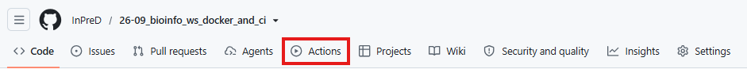

---

We see that the workflow was triggered by our last commit. To inpect we simply click on the workflow run named by our last commit message.

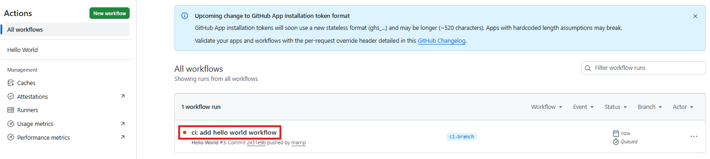

---

Our job `say-hello` was triggered. Select the job to inspect it.

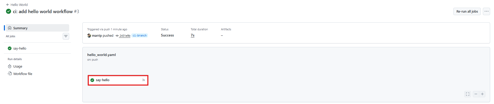

---

We see several steps being run which we can expand by clicking on them. But most importantly, our workflow was successfully run! 🎉

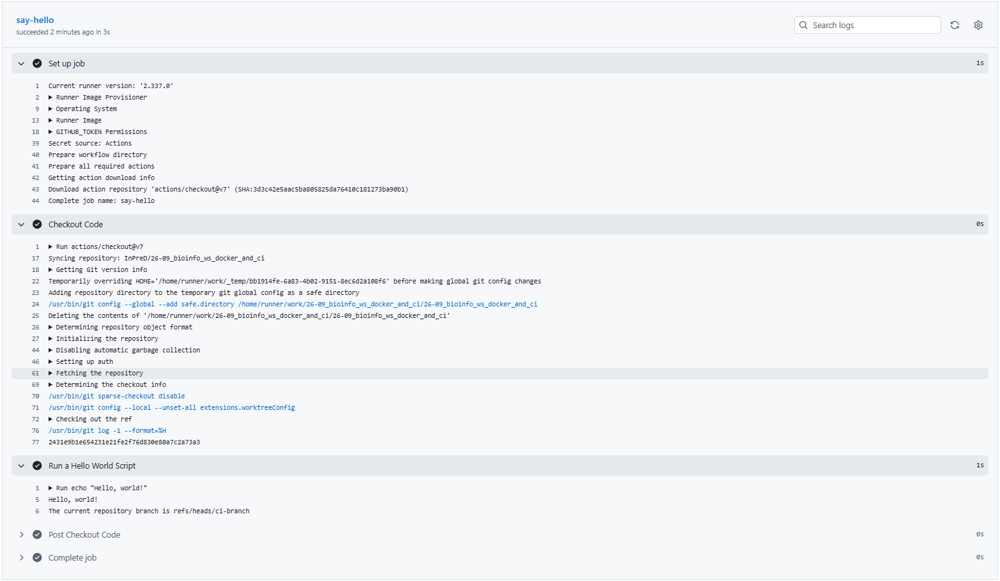

---

Let's use GitHub actions to lint our Dockerfile and build the image. We start by creating `.github/workflows/docker.yaml` and add the following:

```yaml
name: Docker Lint and Build
on: [push]

jobs:
  lint:
    name: Build Image
    runs-on: ubuntu-latest
    steps:
        # action to checkout repository
      - name: Check out the repo
        uses: actions/checkout@v7
        # action to use hadolint for linting the Dockerfile
      - name: Lint Dockerfile
        uses: hadolint/hadolint-action@v3.5.0
```

---

After adding the new workflow, we can commit both the `Dockerfile` and `.github/workflows/docker.yaml`:

```bash
# stage the Dockerfile and workflow yaml file
$ git add Dockerfile .github/workflows/docker.yaml
# commit with commit message using appropriate git commit tag
$ git commit -m "ci: add Dockerfile and docker workflow"
# push the changes to the remote
$ git push
```

We navigate to `Actions` on GitHub to check if hadolint runs successfully.

---

Building our docker image, we would also like to place it into the GitHub container registry (ghcr). To give the github action runner access to our personal registry, we need to create a personal access token (pat). Click on your avatar in the right corner and select `Settings` from the dropdown.

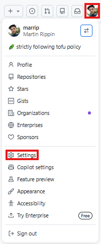

---

In the menu on the left select `Developer settings`.

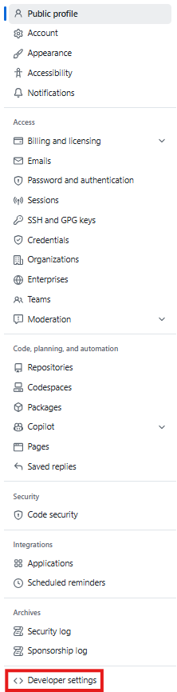

---

Expand `Personal access tokens` and select `Tokens (classic)`>`Generate new token`>`Generate new token (classic)`.

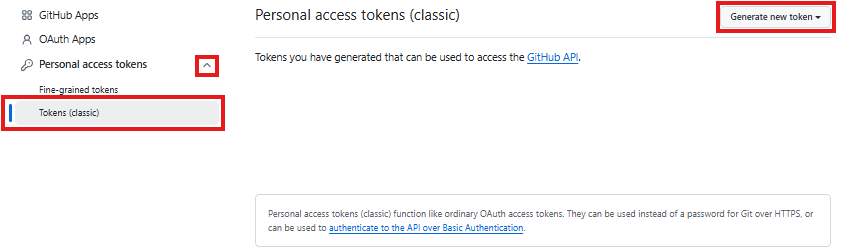

---

Give the token a descriptive name `ghcr_push_token`, select an `Expiration` (7 days should be enough) and select the `write:packages` scope (will automatically select other necessary scopes)

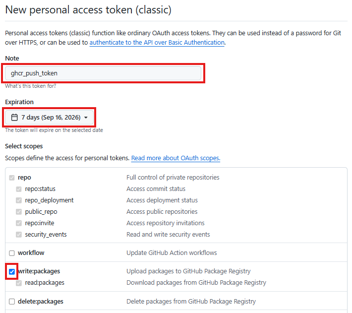

---

Scroll to the bottom of the page and confirm with `Generate token`.

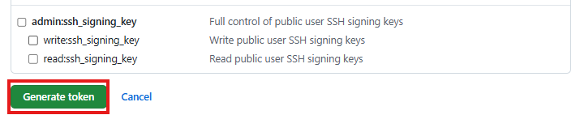

---

Copy the token.

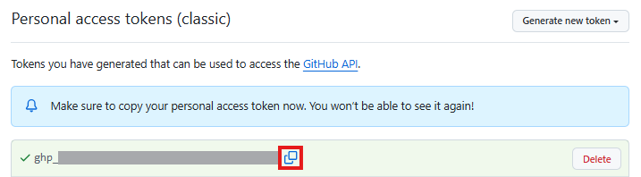

> [!WARNING]
> The token will only be accessible after creation, do not leave this site until you have completed adding it to your repository.

---

Go to your repository and click on `Settings`.

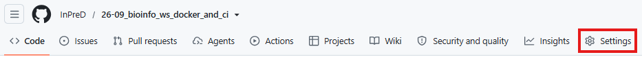

---

In the menu on the left, expand `Secrets and variables` and select `Actions`.

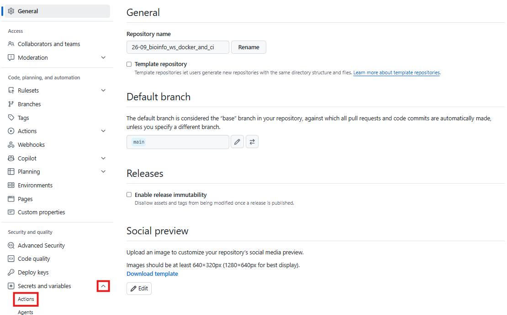

---

Now we give our secret a descriptive name, basically the same as before `GHCR_PUSH_TOKEN`, add the secret we have copied (`ghp_*`) and confirm with `Add secret`.

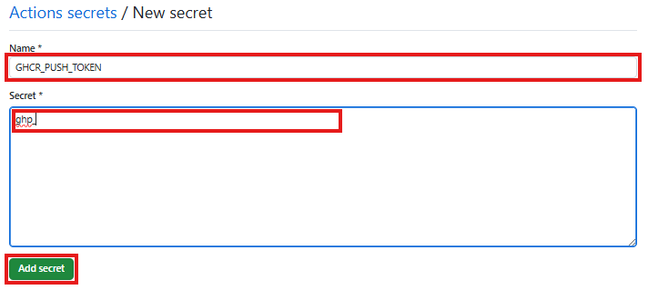

The secret should now be in your list of secrets and we can start to use it.

---

Now we expand our docker workflow by adding the build job below the lint job:

```yaml
name: Docker Lint and Build
on: [push]

jobs:
  lint:
    ...
  build:
    name: Build Image
    runs-on: ubuntu-latest
    needs: lint # wait for lint to complete successfully
    steps:
      - name: Check out the repo
        uses: actions/checkout@v7
      # action to login to GitHub container registry
      - name: Login to GitHub container registry
        uses: docker/login-action@v4
        with:
          registry: ghcr.io # address to GitHub container registry
          username: ${{ github.actor }} # the user triggering the workflow
          password: ${{ secrets.GHCR_PUSH_TOKEN }} # The personal access token we have created earlier
      # action to build and push the image to GitHub container registry
      - name: Build and push image to GitHub container registry
        uses: docker/build-push-action@v5
        with:
          push: true
          tags: |
            ghcr.io/${{ github.actor }}/greeter:latest
```

---

Again, we commit and push:

```bash
# stage the workflow yaml file
$ git add .github/workflows/docker.yaml
# commit with commit message using appropriate git commit tag
$ git commit -m "ci: add build job to docker workflow"
# push the changes to the remote
$ git push
```

And we check `Actions` to see if the workflow completes successfully.